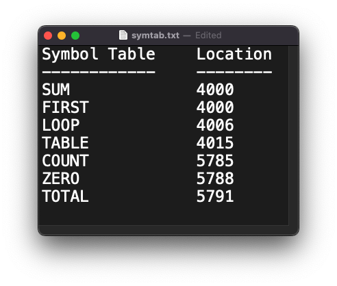

# SIC-Assembler
A SIC Assembler Implementation for 1-Pass Assembler. The assembler should 
take an input a source code written in assembly language and produce the 
SYMTAB an intermediate file in pass 1.

 
## Screenshots  
  

 
## Usage/Examples  
~~~shell  
Usage: sic-assembler.sh <input file>
~~~  
